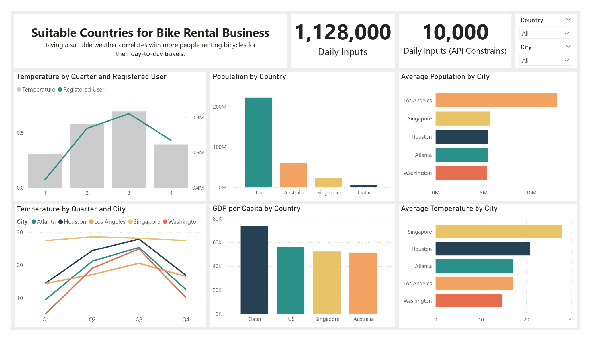
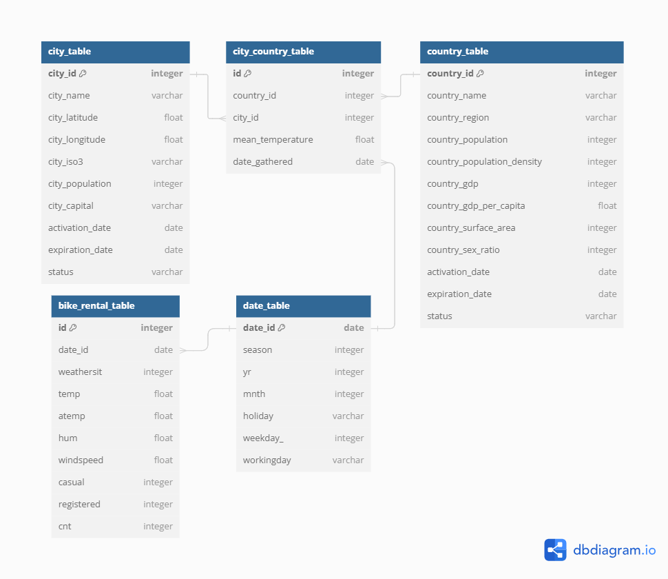
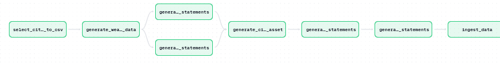

# 🚴‍♂️ Bike Rental & Weather Data Pipeline ☁️



## Project Summary

This project demonstrates how bike rental data can be collected and enriched with live weather information from an external API. The solution leverages **Docker**, **Dagster**, **PostgreSQL**, and **Python**, while following **Kimball’s star schema** principles and applying **Slowly Changing Dimensions (SCD)**. The pipeline is configured to execute every hour, producing more than **one million records per day**.

## Technology Stack

- **Docker:** Ensures the application runs inside isolated containers with independent services.  
- **Dagster:** Handles workflow orchestration and schedules the hourly jobs.  
- **PostgreSQL:** Stores rental history alongside real-time weather datasets.  
- **Python:** Powers the ETL processes including extraction, transformation, and loading.  



## Pipeline Workflow

1. **Extract:** Collect city coordinates (latitude/longitude) across the globe and fetch weather metrics through the API.  
2. **Transform:** Generate dynamic SQL `INSERT` commands tailored for PostgreSQL.  
3. **Load:** Persist both historical rentals and streaming weather updates into the database.  
4. **Orchestrate:** Deploy and manage all services via Docker containers under Dagster’s scheduling.  



## Setup Guide

### Requirements

- Install **Docker**  
- Install **Python 3.8+**  

### Installation Steps

1. **Clone this repository:**  
   ```bash
   git clone https://github.com/extrm-gn/DE-Bike-rental.git
   cd DE-Bike-rental
   docker-compose up --build
